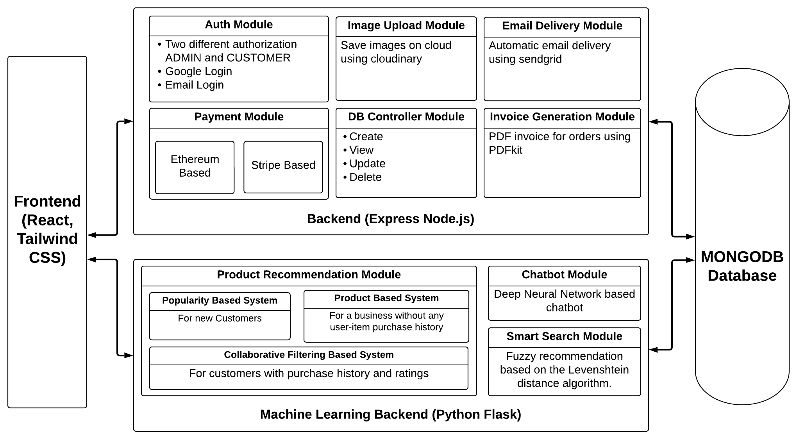
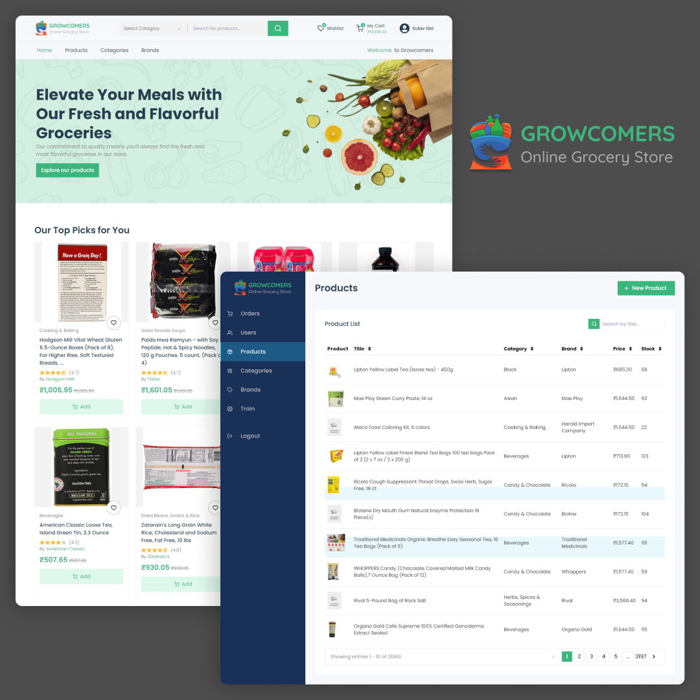
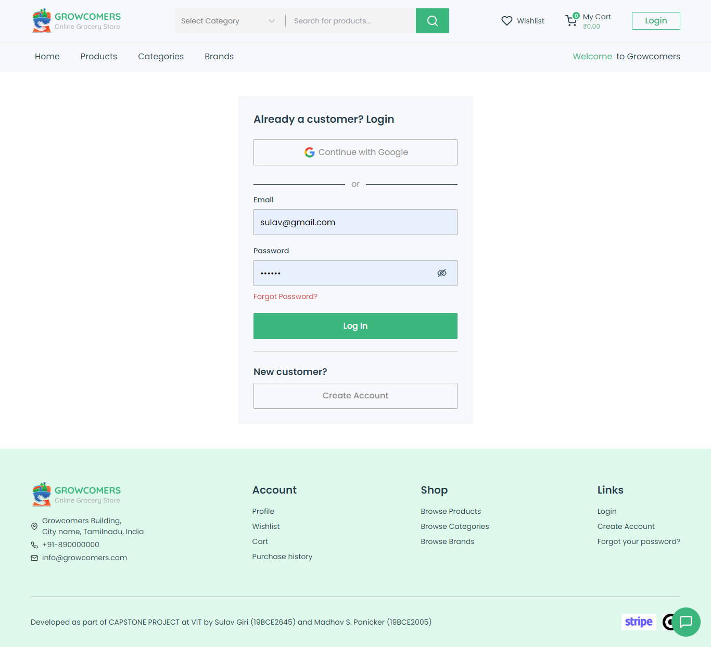
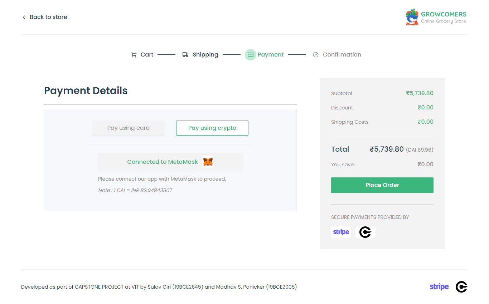

# Growcomers: Online Grocery Store

## Table of Contents

- [Overview](#overview)
- [Deployment](#deployment)
- [Dataset](#dataset)
- [Technologies](#technologies)
- [Features](#features)
- [Architecture](#architecture)
- [Screenshots](#screenshots)

## Overview

This repository contains the source code of the web application built for final year thesis on **Implementation of Recommender System and Cryptocurrency Payments in E-commerce**. The E-commerce Web Application built using React, Tailwind CSS, and Redux in the frontend. The application consists of two backend servers: a Node.js server for data management and authentication, and a Python Flask server for handling machine learning models.

The platform provides a range of features including:

- Hybrid product recommender system incorporating neural collaborative filtering, content-based filtering, and popularity recommender algorithms.
- Chatbot for assisting users and addressing their queries.
- Fuzzy matching-based smart search for efficient product discovery.
- Support for online payments using credit cards and cryptocurrency.
- Invoice generation and automatic email delivery.

## Deployment

The application has been deployed and is accessible at the following link: [Growcomers: Online Grocery Store](https://growcomers.netlify.app). The website is a demo application and we do not fulfill any orders placed at the website.

## Dataset

We have used Grocery and Gourmet Food dataset from [Amazon Reviews Data](https://nijianmo.github.io/amazon/index.html) to train our recommender system model and the metadata from the same dataset is used in our website. We do not own the dataset.

## Technologies

The following technologies were used in the development of this project:

- React
- Tailwind CSS
- Redux
- Node.js
- Python Flask
- MongoDB
- Cloudinary
- SendGrid
- Stripe
- Ethereum
- Solidity
- Truffle
- Ganache

## Features

- **Hybrid product recommender system**: The recommender system combines neural collaborative filtering, content-based filtering, and popularity-based recommendations to provide personalized product recommendations to users.

- **Chatbot**: The built-in chatbot assists users by addressing their queries, adding product to carts, and providing relevant information about orders and services.

- **Fuzzy matching-based smart search**: The search functionality employs fuzzy matching algorithms to offer intelligent and efficient product search capabilities, ensuring users find what they're looking for quickly.

- **Online payments**: Seamless integration with credit card and cryptocurrency payment gateways enables secure and hassle-free online transactions.

- **Invoice generation**: The system generates detailed invoices for each transaction, providing users with a comprehensive breakdown of their purchase.

- **Automatic email delivery**: Users receive automated email notifications for activating their account and resetting their password.

- **Admin Panel**: The admin can manage the orders, users, products and also train the machine learning models.

## Architecture

The system architecture is a three-tier architecture with Frontend, Backend (Server) and database. The main system that the application uses are divided into modules and implemented in the respective backend servers. The frontend interacts with backend using REST APIs and the backend is connected to MongoDB using the MongoDB driver.

## Screenshots

  
  

  
  

